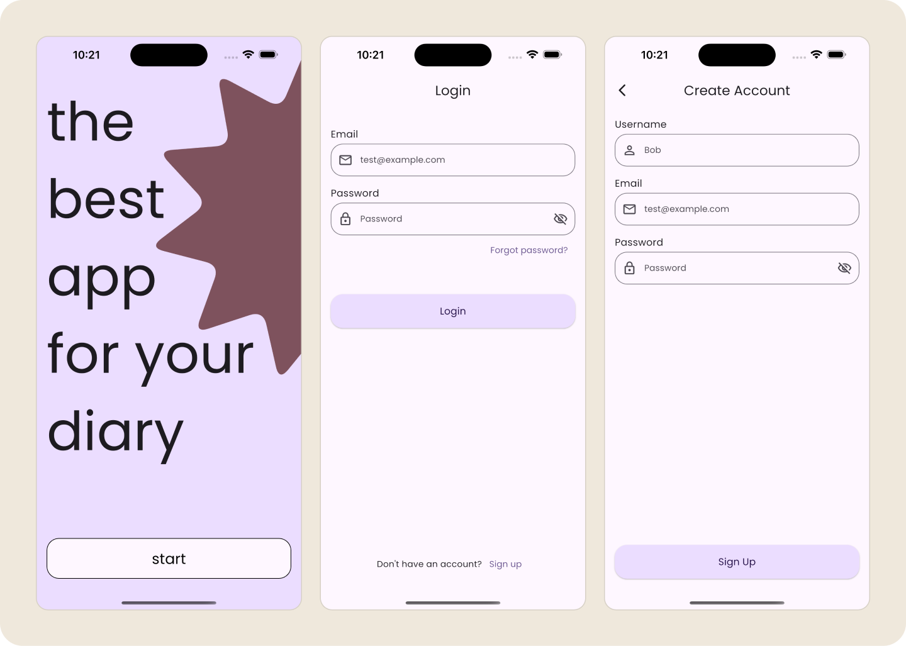
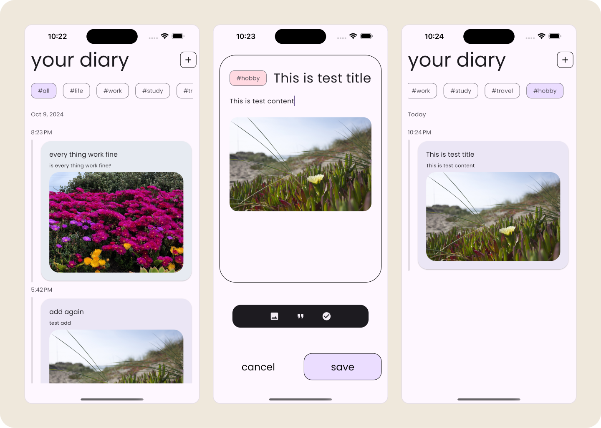

# Diary
> A simple diary app.

Diary is a simple diary app built using Flutter, BLoC, and Firebase, allowing users to document their daily activities with titles, content, tags, and optional images. 

---
# Author

**Rocky Hunag** 
* *Initial work* - [Diary][repository-url] (Repository space)
* *My professional profile on* [LinkedIn][linkedin-url]

# Preview

## Reference
https://dribbble.com/shots/21193267-Diary-Mobile-IOS-App

<!-- Markdown link & img dfn's -->
[repository-url]: https://github.com/y0S6m1sP/Diary
[linkedin-url]: www.linkedin.com/in/jie-yu-huang-28a601161